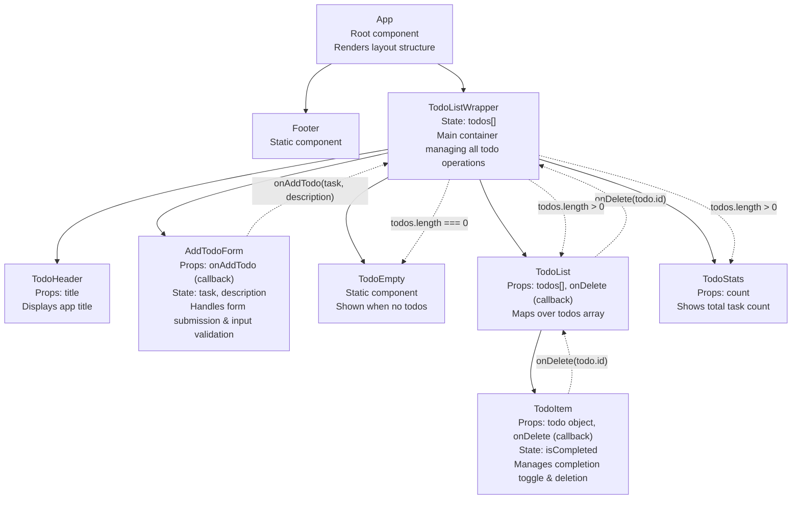

# Homework/Lab 3

This is the third task from my university React course.
What needed to be done:

_Build a small To-Do list application in React. The app should allow users to add new tasks,
mark them as complete, and remove them + The Component Tree & Data Flow diagram in the README.md._

## Component Tree

## Data Flow

### State Colocation

- TodoList: Manages the list of todos (`todos: Todo[]`)
- TodoItem: Manages its own completion status (`isCompleted: boolean`)
- AddTodoForm: Manages input field value (`inputValue: string`)
- App: No state - serves as composition root only
